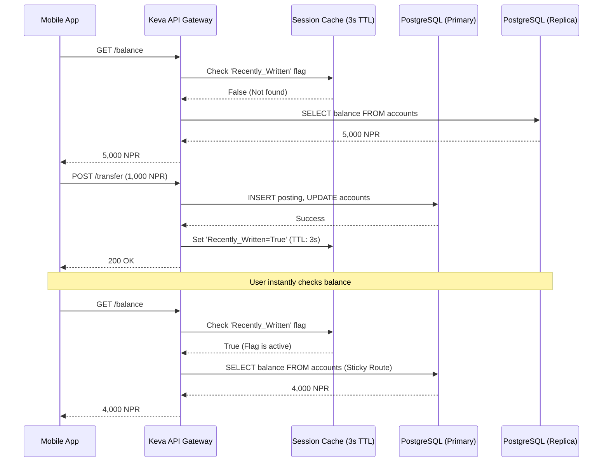

# The Keva Ledger: Core Architecture & Dataflow

## 1. The Core Paradigm: Hexagonal Architecture

The system is optimized for maximum code leverage across multiple business
verticals (Banking, Property Management, Salon Management).

- **The Domain Crate**: The pure double-entry accounting math and validation
  rules live in an isolated Rust library (`kevalabs-ledger-core`). It has zero
  database dependencies and compiles instantly.
- **The Adapters**: For Keva, this crate is plugged into a standard PostgreSQL
  adapter. This exact same crate can be reused across different SaaS products,
  ensuring mathematical perfection across the entire portfolio without rewriting
  logic.

## 2. The Double Entry Constraint

Every transaction must balance to zero. `Sum(Debits) - Sum(Credits) == 0`. If
not, the system must return `TransactionError::AccountingImbalance`.

## 3. The Database & Concurrency Model

To keep infrastructure simple and avoid the distributed consensus latency of
NewSQL (like CockroachDB or SurrealDB), Keva relies on standard, battle-tested
relational physics.

- **Optimistic Locking (Versioning) / OCC**: The system uses Optimistic
  Concurrency Control with standard PostgreSQL row-locks and `sqlx` for account
  balances to avoid database deadlocks and ensure high throughput.
- **The Hot-Key Solution**: To bypass the physical limits of row-locking on
  high-volume accounts (e.g., 10,000 salary deposits), the API enforces a strict
  routing rule. Any batch over 100 transactions is automatically diverted away
  from the main account and routed into a temporary Virtual Clearing Account,
  neutralizing the concurrency bottleneck entirely.

## 4. The Product Catalog (keva-catalog)

Products are treated as data, not code. For instance, a 'Gold Saver' is defined
as a JSON configuration rather than a hard-coded class. Product rules (fees,
overdrafts) are managed with strict regulatory compliance, eliminating the risk
of data loss from simple database updates.

- **Bitemporal Immutability**: Products are versioned using `effective_from` and
  `effective_to` dates.
- **The Maker-Checker Event Log**: Keva completely forbids `UPDATE` statements
  for modifying product rules. Instead, it uses an append-only sequence of
  states (Proposed, Approved, Revoked). Mistakes are fixed by issuing a Revoked
  tombstone event and appending a new Proposed event, preserving a
  mathematically perfect audit trail for central bank inspectors.

## 5. The Asynchronous Batch Engine

Batch files (like payroll) are processed safely and in parallel without blocking
the API or the branch managers.

- **The Worker Pool**: A fleet of background Tokio workers continuously polls
  the database.
- **Parallel Execution**: Workers use PostgreSQL's
  `SELECT ... FOR UPDATE SKIP LOCKED` to grab chunks of transactions. This
  allows 100 workers to process 50 different branch files simultaneously with
  zero row contention.
- **Exception Handling (Suspense GL)**: If a target account is blocked (e.g.,
  KYC failure), the transaction does not reverse and ruin the corporate client's
  statement. The funds are routed to a static Branch Suspense GL, triggering a
  manual human-in-the-loop review to keep the automated batch moving.
- **Safe Halt & Sweep**: If a batch is cancelled mid-flight, workers drop their
  queues instantly. An orchestrator executes a single atomic sweep to return any
  remaining funds from the Virtual Clearing Account back to the corporate
  client, maintaining a perfect audit trail without illegal automated clawbacks.

## 6. Infrastructure & Deployment Setup

The deployment strategy completely avoids Kubernetes to eliminate unnecessary
DevOps overhead, relying on robust, static container orchestration.

- **The Stateless Plane (Rust APIs)**: Deployed via Docker Swarm across basic
  Linux VMs. Auto-scaling is disabled in favor of Static Scaling
  (pre-provisioning for peak load) to protect the database from connection
  exhaustion. Zero-downtime updates are managed via Traefik (Blue/Green or
  Rolling).
- **The Stateful Plane (Database HA)**: Deployed on three static VMs using
  standard `docker-compose` and systemd.
- **Connection Routing**: The Rust app uses a small internal `sqlx` pool,
  connecting to a centralized PgBouncer container (Transaction Pooling) to
  protect Postgres from OS-process exhaustion.
- **High Availability Control**: Patroni and etcd monitor the PostgreSQL
  Primary. If it fails, Patroni automatically promotes a Replica and updates
  PgBouncer's routing within seconds, providing Tier-1 failover without human
  intervention.

## 7. Dataflow Diagram

```text

[ External Clients (Mobile, Web, ATMs) ]
                                     │
                                     ▼  (HTTP / JSON)
    ┌──────────────────────────────────────────────────────────────────┐
    │                              keva-api                            │
    │                   (Transport / REST / gRPC)                      │
    └────────────────────────────────┬─────────────────────────────────┘
                                     │
                                     ▼  (Domain Commands / Rust Structs)
    ┌──────────────────────────────────────────────────────────────────┐
    │                            keva-accounts                         │
    │               (The Orchestrator / State Management)              │
    └──────────────┬───────────────────────────────────┬───────────────┘
                   │                                   │
         1. Checks Product Rules            2. Sends Validated Entries
                   │                                   │
                   ▼                                   ▼
    ┌─────────────────────────────┐     ┌──────────────────────────────┐
    │        keva-catalog         │     │         keva-ledger          │
    │    (The Product Engine)     │     │    (The Source of Truth)     │
    │                             │     │                              │
    │ - Interest Configurations   │     │ - Double-Entry Math          │
    │ - Fee Structures            │     │ - Immutable Journal          │
    │ - Overdraft Limits          │     │ - Optimistic Concurrency     │
    └─────────────────────────────┘     └──────────────┬───────────────┘
                                                       │
                                                       ▼  (SQLx / OCC)
                                      ==================================
                                      [(      PostgreSQL Database     )]
                                      [  -> account_balances (State)   ]
                                      [  -> journal_entries (Log)      ]
                                      ==================================

```

## 8. The Architecture Breakdown (How Data Flows)

To make this diagram actionable, a single action is traced below: A customer
deposits 1,000 NPR.

### Step 1: The Adapter Layer (keva-api)

- **Action**: Receives an HTTP POST request with a JSON payload
  (`{ "account_id": "uuid-123", "amount": "1000.00" }`).
- **Responsibility**: It validates the JSON, authenticates the token, maps the
  request to a Keva domain command, and passes it down. It knows nothing about
  banking math.

### Step 2: The Orchestrator (keva-accounts)

- **Action**: Receives the internal command to deposit 1,000 NPR into
  `uuid-123`.
- **Responsibility**: This is the traffic cop.
  - It looks up the account to find its assigned Product ID.
  - It queries `keva-catalog`: "Does Product X allow deposits?"
  - If yes, it constructs a `JournalEntry` (Debit Cash, Credit Customer
    Account).
  - It sends the `JournalEntry` to `keva-ledger`.

### Step 3: The Configuration Engine (keva-catalog)

- **Action**: Responds to `keva-accounts` with the rules for the specific
  account's product.
- **Responsibility**: Pure configuration. It holds definitions like "Gold
  Savings Account: Max Deposit = 100,000, Interest = 5%." It does not touch the
  database containing user balances.

### Step 4: The Source of Truth (keva-ledger)

- **Action**: Receives the `JournalEntry`.
- **Responsibility**: The strict, immutable core.
  - It asserts `Sum(Debits) == Sum(Credits)`.
  - If the math is perfect, it attempts to write to PostgreSQL using Optimistic
    Concurrency Control.
  - If successful, it returns an `Ok(())` back up the chain.

## 5. Scalable Balance Retrieval (Read/Write Splitting)

In retail banking, passive read traffic (users refreshing their balance) often
accounts for over 90% of database load. Keva utilizes native PostgreSQL
**Read/Write Splitting** to protect the ledger's mutation throughput. We
deliberately avoid strict CQRS and background projection workers to minimize
infrastructure complexity (See ADR 0002).

- **The Write Path:** All ledger mutations (`INSERT` postings, `UPDATE` account
  balances) are routed strictly to the **Primary PostgreSQL Node** to guarantee
  ACID compliance and Optimistic Concurrency Control (OCC).
- **The Read Path:** Standard balance inquiries (`SELECT`) are routed to a pool
  of **PostgreSQL Read Replicas**, synchronized via native binary streaming
  replication.

### The "Primary-Read-After-Write" Rule

To prevent user panic caused by microsecond replication lag (e.g., a user
transfers money and instantly checks their balance before the replica updates),
the API Gateway enforces "Sticky Routing":

1. When a user successfully mutates state (Write), the API caches a
   `Recently_Written` flag (TTL: 3 seconds) for that specific user session.
2. Any subsequent balance read requests from that user within the 3-second
   window are intercepted and routed directly to the Primary Node.
3. Once the TTL expires, read traffic safely defaults back to the Replica pool.



## 6. Architecture Decision Records (ADRs)

- [ADR 0001: Adopt Optimistic Concurrency Control (OCC) over Event Sourcing for Core Ledger](./adr/0001-use-occ-over-event-sourcing.md)
- [ADR 0002: Adopt Database Read/Write Splitting over Strict CQRS](./adr/0002-read-write-splitting-over-cqrs.md)
