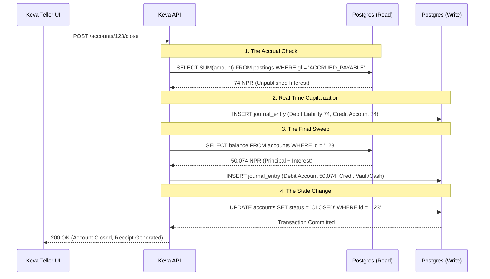
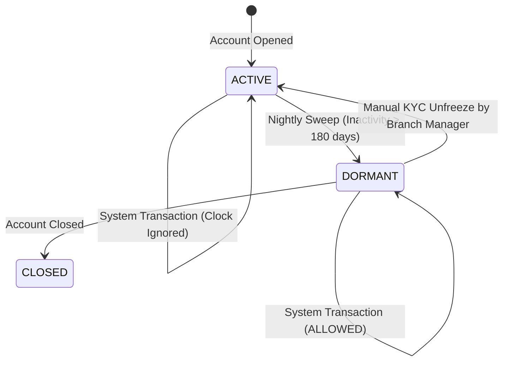

# Account Lifecycle & State Transitions

This document defines the strict business rules and ledger mutations required
for standard account lifecycle events within the Keva Core Banking system.

## 1. Account Closure (Real-Time Settlement)

**Business Context:** When a customer requests an account closure, the bank
legally owes the customer any interest accrued up to that exact day, even if the
scheduled batch capitalization (monthly/quarterly) has not yet occurred. The
system cannot wait for the batch job; it must perform a real-time settlement
before allowing the final withdrawal.

**The Ledger Rules:** An account can only transition to a `CLOSED` state if its
available balance is exactly `0.00` and its linked accrued liability is exactly
`0.00`.

### The Closure Workflow

## Operational Invariants

- **Batch Job Safety:** The standard End-of-Day and End-of-Month batch jobs only
  query accounts where status = 'ACTIVE'. By closing the account in real-time,
  the async workers will naturally skip this account, preventing any
  double-payment of interest.

- **Atomic Execution:** Steps 2, 3, and 4 must be executed within a single
  PostgreSQL database transaction to ensure the ledger is never left in a
  partially settled state if the API crashes during the closure.

## 2. Account Dormancy

**Business Context:** To comply with regulatory guidelines (e.g., NRB) and
prevent fraud on abandoned funds, accounts must be frozen after a prolonged
period of inactivity. A dormant account rejects all outgoing customer-initiated
debits (withdrawals, POS swipes, transfers) until the customer completes KYC
verification at a branch.

**The Trigger:** Dormancy is calculated based strictly on the
`last_customer_activity_at` timestamp.

- System-generated postings (Interest Capitalization, Fee Deductions, Tax
  Withholdings) **do not** update this timestamp.
- Customer-initiated mutations (Deposits, Withdrawals, Inward Transfers) **do**
  update this timestamp.

**The State Transition:** An asynchronous nightly background job sweeps the
`accounts` table. If
`Current Date - last_customer_activity_at > Product.dormancy_days`, the account
status is updated from `ACTIVE` to `DORMANT`.

