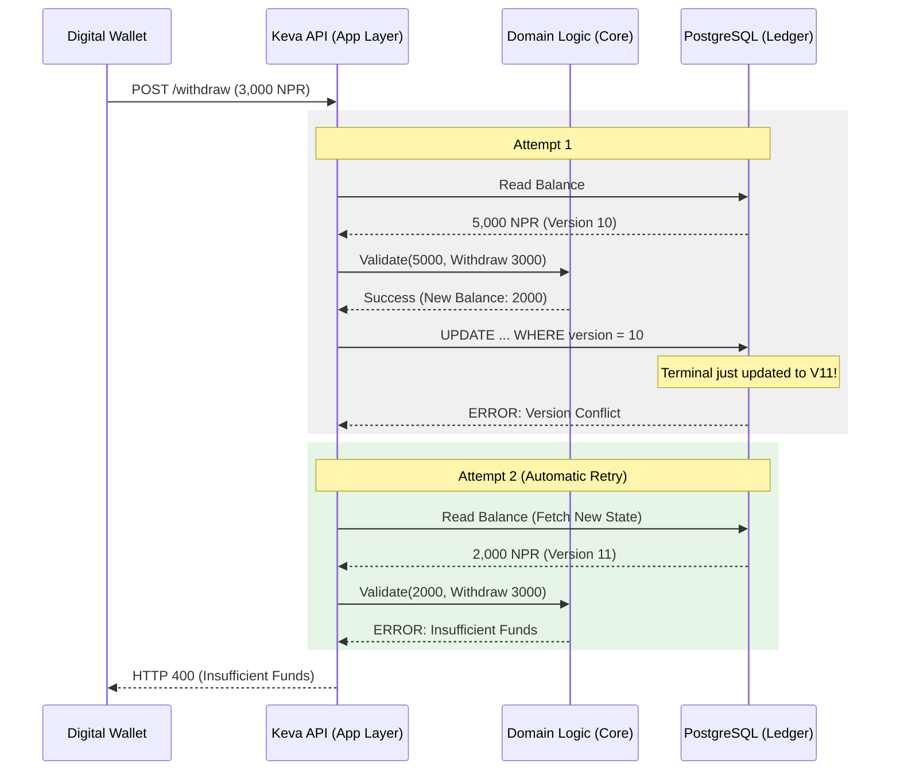

# Edge Case #1: The Microsecond Double-Spend (OCC Conflict)

## 1. Scenario

Two concurrent API requests arrive at the exact same nanosecond, both attempting
to withdraw the last 100 NPR from an account.

## 2. Business Impact

If not handled correctly, the system will either illegally overdraft the account
(double-spend) or return a confusing, generic system error to the customer's
digital wallet, damaging trust. The goal is to enforce mathematical limits while
returning a clear, accurate business reason to the user.

## 3. The Operational Flow

## 4. The Ledger Truth

Only the first transaction (the terminal) successfully writes to the ledger. The
second transaction never touches the database, generating zero ledger
side-effects. There is no need for reversal or suspense account routing because
the double-spend was prevented at the application boundary.

## 5. Technical Resolution

The API controller wraps ledger mutations in an automatic retry loop (up to 3
attempts). On an OCC version conflict, the API aggressively drops the stale
state, re-fetches the latest row, and completely re-evaluates the domain logic
against the new reality before determining if the transaction is still valid.
