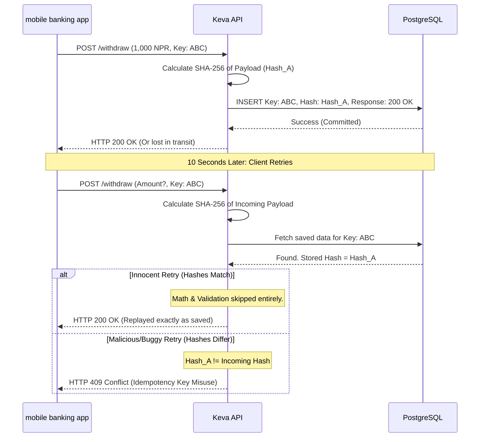

# Edge Case #2: Network Timeout Replays Idempotency Key Misuse

## 1. The Scenario

A client (e.g., a mobile banking app) sends a transaction request with an
'Idempotency-Key'. After Keva successfully processes it, the client retries the
exact same request with the same 'Idempotency-Key'. This can happen either
innocently (a fiber cut caused the client to miss the HTTP 200 OK success
message) or maliciously (an attacker alters the payload to withdraw more money
but reuses the valid key).

## 2. Business Impact

Keva must seamlessly absorb network shocks without double-charging the
customer's account. Simultaneously, it must violently reject any attempt to
alter the payload of a retried request, preventing attackers from tricking the
terminal into dispensing unrecorded cash.

## 3. The Operational Flow

## 4. The Ledger Truth

The ledger is mathematically isolated from both the innocent retry and the
malicious alteration. Only the very first successful request generates a ledger
posting. All subsequent requests sharing the key are intercepted at the API
layer, generating zero double-entry side effects.

## 5. Technical Resolution

The Keva database maintains an 'idempotency_keys' table with a
'UNIQUE(client_id, idempotency_key)' constraint and a 'payload_hash' column.
Before mutating any state, the API calculates a SHA-256 hash of the JSON body.
If the key already exists in the database, the API compares the incoming hash to
the stored hash to either replay the saved response or throw a strict HTTP 409
Conflict.
