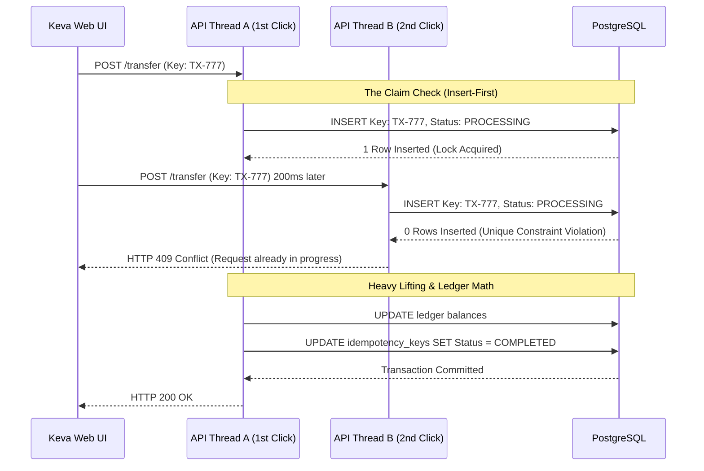

# Edge Case #3: The Concurrent Double-Click (In-Flight Duplication)

## 1. The Scenario

A branch manager or customer submits a high-value transaction (e.g., 5,000,000
NPR transfer) and, experiencing network lag, double-clicks the "Submit" button
200 milliseconds later. The first request is currently executing the heavy
ledger math, meaning the final success state has not yet been saved to the
database. Both identical requests are now active in the API simultaneously.

## 2. Business Impact

If the API solely checks the database at the end of the transaction, both
requests will read the same starting balance, perform the math, and attempt to
debit the account. If OCC catches it, it throws a confusing system error. If OCC
misses it (due to poor isolation levels), the bank accidentally transfers
10,000,000 NPR. The system must instantly halt the second click without relying
on complex external locking mechanisms like Redis.

## 3. The Operational Flow

## 4. The Ledger Truth

The ledger math is executed exactly once. The second request is neutralized at
the API boundary layer in less than a millisecond, preventing any accidental
double-entry postings or unnecessary database strain.

## 5. Technical Resolution

Keva implements the Claim Check Pattern using PostgreSQL's UNIQUE constraints.
When a request arrives, the API immediately opens a database transaction and
executes an INSERT ... ON CONFLICT DO NOTHING into the idempotency_keys table
with a status of PROCESSING.

- If the insert succeeds, this specific API thread "owns" the request and
  proceeds with the ledger math.

- If the insert returns 0 rows affected, it means another thread is currently
  processing this exact key. The API instantly drops the request and returns an
  HTTP 409 Conflict.

Once the ledger math is finished, the owning thread updates the key's status to
COMPLETED and commits.
